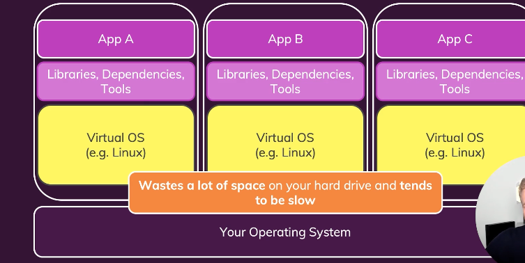
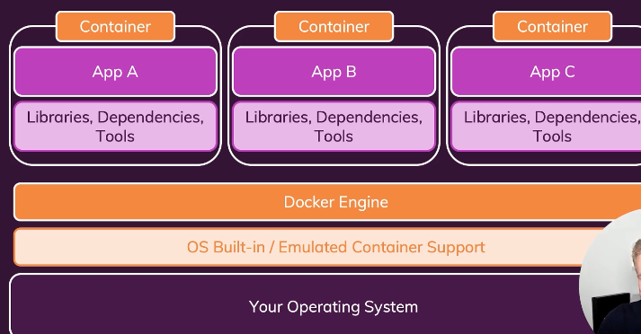

# Docker And Kubernetes The Pratical Guide

> Content: https://demy.com/course/docker-kubernetes-the-practical-guide/

## Docker

We are using docker for encapsulate to application. Docker lighter than virtual machines.

- Docker playground: https://labs.play-with-docker.com

- Docker linux hariç diğer işletim sistemlerinde sanallaştırma kullanır. 
- Base olarak linux vardır. Windowsta bu wsl2 veya hyper-v ile yapılır. 
- Bunu indirdiğimiz docker desktop yönetir.
- Bu sanallaştırmanın üzerinde ise docker engine çalışır.

### Images And Containers
- Containers are unit of software
- Images are templates/blueprints for containers

#### Images
- Image'i oluşturmak için dahi base bir image'e ihtiyacımız vardır.
- Image bir template'dir. 
- Çalıştırma komutu geldiğinde template localde yoksa indirilir ve template docker tarafından dockerfile'da tanımlanmış son yürütme komutu ile container olarak çalışır yapıya dönüşür.
- Image read only bir yapıdır.
- Dışarıdan değişiklik yapılamaz.

### Docker In Practice
- docker pull \<image name>
- docker run -p 3000:3000 \<id or name>
  - (publish) \<external port>:\<internal port>
  - Bulunulan ortamda belirtilen portta container'ın belirtilen port'unu yayınla.
- docker images
- docker ps 
  - (process)
- docker ps -a 
  - (get run or stopped containers)
- docker run -it node
  - (interactive terminal)
  - Çalışan konteynırda bir terminal açayı sağlar.
- docker build .
  - \<.> dockerfile'ın yerini belirtir.
- docker stop
  - container'ın çalışmasını durdur.
- docker start

### LAYER BASE IMAGES
- Her satır bir layerdır. Layerlar cachelenir. Eğer docker çalıştırılan layer'ın cache'ine sahipse ve bir değişime uğramamışsa layer'ı cache'den getirir.

### Managing Image And Container
- Image
  - docker tag
    - tagged an image
  - docker images
    - listed
  - docker image inspect
    - analyzed image
  - docker rmi
    - delete
  - docker prune
    - delete
- Container
  - docker --name
  - docker --help
  - docker ps
  - docker rm

Run command details

docker run 
-a / attach
-d / detach 
- (attach mode) -> default detach mode'dur (-d)
- attach mode console'u dinler.
- detach mode sadece id değeri döner. Uygulama arka planda çalışır.

-t/--name myName
- (tagged)
- uygulamanın adını belirlemiş oluruz.

-p 8080:8080
-  port ataması yapılır.

--rm
- eğer container exit statüsüne geçerse container silinir.

name:tag

docker build
-f \<Dockerfile_path>

.
- docker build işlemini başlattığında dış dosya konumu olarak gösterilecek yer.

-t name:tag
- name repository yerine kaydedilir.
  - Örneğin
    - ubuntu repodur. Tagleri ile istenilen versiyon çekilebilir.
- tag ise version'u belirtir.
  - latest belirtilirse sadece isimle çalıştırmalarda bu image çekilir.
  - latest default tagdir.(run komutu için)
  - Belirtilmez ise null yazılır.

-a / attach

####Others
docker logs
- anlık logları basar

docker logs -f
- loglar takibini devam ettirir.

docker attach \<container>
- detach mode'da çalışan container'ı attach mode'a alır.

docker -it \<container>
- interaktif bir terminal açar.
- run komutu ilede kullanılabilir.

docker rm \<container>
- delete container or containers

docker rm $(docker ps -a)
- delete all containers

docker rmi \<image>
- delete image or images

docker image prune
- delete all unuse images

docker image inspect \<image>
- Image hakkında detaylı bilgiler içerir.
- Image layerlar create detayları.
- Architecture bilgileri
- Port bilgileri
- gibi gibi....

docker cp \<out_source_path> \<container_name:container_path>
docker cp \<container_name:container_path> \<out_source_path> 
- container dışından konteynır içerisine veya tam tersi olacak şekilde kopyalama işlemi yapar.
- Örneğin
  - docker cp dummy/test.txt boring_vaughan:/test
  - log kayıtlarını local makinemize çıkarabiliriz.

## Image Pull And Push
- Aşağıdaki gibi işlemleri yaparsak image default registry olan docker hub'a gider.
  - docker login
  - docker push image_name:tag
  - docker pull image_name:tag

- Aşağıdaki gibi işlemleri yaparsak image login olunan image registry repo'suna gider
  - docker login \<private_registry>
  - docker push \<image_repo_address>/image_name:tag
  - docker pull \<image_repo_address>/image_name:tag

docker tag \<old_name>:tag \<new_name>:tag

- push işleminde base image push olmaz. Extra işlemler pushlanır.
- pull işleminde login olunmamış olursa otomatik docker hub'a bakılır.